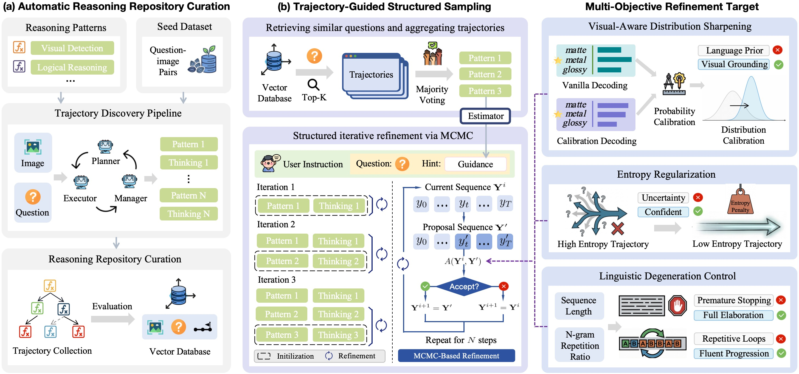

<h1 align="center">
  Aligning Large Vision–Language Models at Test Time:<br>
  A Trajectory-Guided Structured Sampling Approach
</h1>


<p align="center">   <a href="https://arxiv.org**git** add README.md/abs/2608.03204"></a>   <a href="https://doi.org/10.1145/3767308.3835984"></a> </p>

<p align="center">   <strong>Tianbao Jiang</strong>, Weicong Ni, Gerard de Melo, Linlin Wang </p>

<p align="center">    accepted by <strong>ACM Multimedia 2026</strong>. </p>

## Overview

<p align="center">    </p>

## Citation

```
@misc{jiang2026aligninglargevisionlanguagemodels,
      title={Aligning Large Vision-Language Models at Test Time: A Trajectory-Guided Structured Sampling Approach}, 
      author={Tianbao Jiang and Weicong Ni and Gerard de Melo and Linlin Wang},
      year={2026},
      eprint={2608.03204},
      archivePrefix={arXiv},
      primaryClass={cs.CL},
      url={https://arxiv.org/abs/2608.03204}, 
}
```

